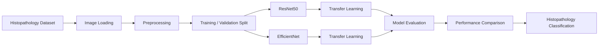

<div align="center">

# 🫁🔬 Lung & Colon Cancer Classification

### Histopathology Image Classification with ResNet50 & EfficientNet

<p>
  An end-to-end deep learning project for classifying
  <strong>lung and colon histopathology images</strong>
  across five tissue categories using modern convolutional neural networks
  and transfer learning.
</p>

<br>


<br>

**Transfer Learning • Medical Imaging • Histopathology • CNN • Deep Learning**

</div>

---

## ✨ Overview

Cancer diagnosis from histopathological images is an important application of **Artificial Intelligence in medical imaging**.

This project explores deep learning-based classification of microscopic tissue images using two powerful convolutional neural network architectures:

* **ResNet50**
* **EfficientNet**

The models learn discriminative visual patterns from histopathology images and classify tissue samples into **five lung and colon tissue categories**.

The project demonstrates a complete computer vision workflow involving:

**Data Preparation → Preprocessing → Transfer Learning → Model Training → Evaluation → Prediction**

> **Important:** This repository is intended for research, experimentation, and educational purposes. It is not a clinical diagnostic system.

---

## 🎯 Project Objectives

The primary goals of this project are to:

* Build an automated histopathology image classification pipeline.
* Apply **transfer learning** using pretrained CNN architectures.
* Compare the behavior of **ResNet50** and **EfficientNet**.
* Classify lung and colon tissue into multiple histological categories.
* Explore deep learning for medical image analysis.
* Build a reusable foundation for more advanced medical AI research.

---

## 🧬 Classification Classes

The dataset contains **five balanced classes**.

|  ID  | Tissue Class                    | Category  |
| :--: | ------------------------------- | --------- |
| `01` | 🫁 Lung Benign Tissue           | Benign    |
| `02` | 🫁 Lung Adenocarcinoma          | Malignant |
| `03` | 🫁 Lung Squamous Cell Carcinoma | Malignant |
| `04` | 🧫 Colon Adenocarcinoma         | Malignant |
| `05` | 🧫 Colon Benign Tissue          | Benign    |

Each category contains approximately **5,000 images**, resulting in a total dataset size of approximately:

<div align="center">

### `25,000 Histopathology Images`

</div>

---

## 📊 Dataset

The project uses a histopathological image dataset containing lung and colon tissue samples.

### Dataset Characteristics

| Property               | Details              |
| ---------------------- | -------------------- |
| 🖼️ Total Images       | **25,000**           |
| 🧬 Number of Classes   | **5**                |
| 📦 Images per Class    | **5,000**            |
| 📐 Original Resolution | **768 × 768 pixels** |
| 🗂️ Format             | **JPEG**             |
| 🫁 Lung Categories     | **3**                |
| 🧫 Colon Categories    | **2**                |

The expanded dataset was produced from validated histopathology samples through image augmentation.

### Original Tissue Categories

The source samples include:

* 250 benign lung tissue images
* 250 lung adenocarcinoma images
* 250 lung squamous cell carcinoma images
* 250 benign colon tissue images
* 250 colon adenocarcinoma images

Data augmentation was then used to expand the dataset to approximately **25,000 images**.

---

## 🧠 Deep Learning Architectures

### 1️⃣ ResNet50

**ResNet50** is a 50-layer convolutional neural network based on residual learning.

Its residual connections help solve problems associated with training very deep neural networks by allowing gradients to flow more effectively through the architecture.

```text
Input Image
     │
     ▼
Preprocessing
     │
     ▼
ResNet50 Backbone
     │
     ▼
Feature Extraction
     │
     ▼
Global Average Pooling
     │
     ▼
Classification Layer
     │
     ▼
5 Tissue Classes
```

### Why ResNet50?

* Powerful feature extractor
* Proven performance in image recognition
* Residual connections improve deep-network optimization
* Excellent architecture for transfer learning
* Strong baseline for medical imaging experiments

---

### 2️⃣ EfficientNet

EfficientNet uses **compound scaling**, balancing:

* Network depth
* Network width
* Input image resolution

instead of scaling only one dimension of a convolutional neural network.

```text
Input Image
     │
     ▼
Preprocessing
     │
     ▼
EfficientNet Backbone
     │
     ▼
Feature Extraction
     │
     ▼
Global Average Pooling
     │
     ▼
Classification Head
     │
     ▼
5 Tissue Classes
```

### Why EfficientNet?

* Excellent accuracy-to-parameter efficiency
* Computationally efficient architecture
* Strong transfer-learning capability
* Effective feature extraction
* Suitable for large-scale image classification

---

## 🏗️ Project Pipeline



---

## 🔄 Machine Learning Workflow

```text
┌─────────────────────────────┐
│ Histopathological Images    │
└──────────────┬──────────────┘
               │
               ▼
┌─────────────────────────────┐
│ Image Preprocessing         │
│ • Resize                    │
│ • Normalize                 │
│ • Data Preparation          │
└──────────────┬──────────────┘
               │
               ▼
┌─────────────────────────────┐
│ Transfer Learning           │
├─────────────────────────────┤
│ ResNet50    │ EfficientNet  │
└──────────────┬──────────────┘
               │
               ▼
┌─────────────────────────────┐
│ Feature Extraction          │
└──────────────┬──────────────┘
               │
               ▼
┌─────────────────────────────┐
│ Classification Head         │
└──────────────┬──────────────┘
               │
               ▼
┌─────────────────────────────┐
│ Five-Class Prediction       │
└─────────────────────────────┘
```

---

## ⚙️ Technology Stack

<div align="center">

| Technology              | Purpose                       |
| ----------------------- | ----------------------------- |
| 🐍 **Python**           | Core programming language     |
| 🧠 **TensorFlow**       | Deep learning framework       |
| 🔥 **Keras**            | Neural network API            |
| 👁️ **Computer Vision** | Histopathology image analysis |
| 📊 **NumPy**            | Numerical computation         |
| 🐼 **Pandas**           | Data manipulation             |
| 📈 **Matplotlib**       | Data visualization            |
| 📓 **Jupyter Notebook** | Model experimentation         |
| 🧬 **ResNet50**         | Deep CNN architecture         |
| ⚡ **EfficientNet**      | Efficient CNN architecture    |

</div>

---

## 📁 Repository Structure

```text
Lung-Colon-Cancer-Classification/
│
├── lung-cancer-effb3-and-resnet50.ipynb
│   └── Model training, evaluation and experimentation
│
├── README.md
│   └── Project documentation
│
└── dataset/
    ├── lung_benign/
    ├── lung_adenocarcinoma/
    ├── lung_squamous_cell_carcinoma/
    ├── colon_adenocarcinoma/
    └── colon_benign/
```

> The dataset directory may not be included directly in the repository due to its size.

---

## 🚀 Getting Started

### 1. Clone the Repository

```bash
git clone https://github.com/Hamza-code-hub/Lung-Colon-Cancer-Classification-ResNet50-EfficientNet.git
```

### 2. Enter the Project Directory

```bash
cd Lung-Colon-Cancer-Classification-ResNet50-EfficientNet
```

### 3. Create a Virtual Environment

#### Windows

```bash
python -m venv venv
venv\Scripts\activate
```

#### Linux / macOS

```bash
python3 -m venv venv
source venv/bin/activate
```

### 4. Install Dependencies

```bash
pip install tensorflow numpy pandas matplotlib scikit-learn jupyter
```

### 5. Start Jupyter Notebook

```bash
jupyter notebook
```

Open the project notebook and execute the cells sequentially.

---

## 🧪 Model Training Strategy

The project follows a transfer-learning workflow.

### Stage 1 — Image Preparation

```text
Histopathology Images
        ↓
Image Resizing
        ↓
Pixel Preprocessing
        ↓
Dataset Splitting
        ↓
Batch Generation
```

### Stage 2 — Feature Extraction

Pretrained convolutional backbones extract high-level image representations.

```text
Pretrained CNN
     ↓
Learned Image Features
     ↓
Task-Specific Classification Layers
```

### Stage 3 — Classification

The final network predicts one of the five histopathological classes.

---

## 📈 Model Comparison

| Feature                      | ResNet50 | EfficientNet |
| ---------------------------- | :------: | :----------: |
| Transfer Learning            |     ✅    |       ✅      |
| Deep Feature Extraction      |     ✅    |       ✅      |
| ImageNet Pretraining Support |     ✅    |       ✅      |
| Residual Connections         |     ✅    |       —      |
| Compound Scaling             |     —    |       ✅      |
| Medical Image Classification |     ✅    |       ✅      |
| Multi-Class Classification   |     ✅    |       ✅      |

Actual experimental performance should be evaluated using metrics generated from the notebook.

---

## 📏 Recommended Evaluation Metrics

For medical image classification, evaluation should not rely only on accuracy.

The following metrics are particularly useful:

```text
Accuracy
Precision
Recall / Sensitivity
F1-Score
Confusion Matrix
ROC-AUC
Training Loss
Validation Loss
```

These metrics make it easier to understand both overall performance and class-specific behavior.

---

## 🔍 Prediction Workflow

During inference:

```text
New Histopathology Image
          ↓
      Resize Image
          ↓
      Preprocessing
          ↓
   Trained CNN Model
          ↓
  Probability Distribution
          ↓
   Highest Probability
          ↓
 Predicted Tissue Category
```

---

## 💡 Potential Applications

Research based on histopathology image classification can support work involving:

* 🔬 Medical image analysis
* 🧬 Computational pathology
* 🫁 Lung cancer research
* 🧫 Colon cancer research
* 🤖 AI-assisted pathology
* 📊 Automated tissue analysis
* 🧠 Deep learning research
* 🏥 Clinical decision-support research

---

## ⚠️ Medical Disclaimer

> This project is provided strictly for **educational and research purposes**.

The models, predictions, experiments, and source code contained in this repository **must not be considered medical advice or used as a substitute for professional pathological examination, clinical diagnosis, or treatment decisions**.

Clinical deployment would require substantially more validation, regulatory review, bias analysis, external testing, explainability assessment, security evaluation, and supervision by qualified medical professionals.

---

## 🔮 Future Improvements

Potential extensions of this project include:

* [ ] Add Grad-CAM explainability
* [ ] Add confusion matrices
* [ ] Add ROC curves and AUC analysis
* [ ] Add class-wise precision and recall
* [ ] Add model checkpoints
* [ ] Add automated inference pipeline
* [ ] Add Streamlit or Gradio web interface
* [ ] Add REST API deployment
* [ ] Add Docker support
* [ ] Add experiment tracking with MLflow
* [ ] Add TensorBoard visualization
* [ ] Add hyperparameter optimization
* [ ] Compare additional architectures
* [ ] Add cross-validation
* [ ] Add external dataset validation
* [ ] Add model interpretability analysis
* [ ] Export model to ONNX or TensorFlow Lite

---

## 🧠 Advanced Architectures to Explore

Future experiments could compare:

```text
ResNet50
   │
   ├── EfficientNet
   ├── DenseNet121
   ├── InceptionV3
   ├── Xception
   ├── ConvNeXt
   ├── Vision Transformer
   └── Swin Transformer
```

This could transform the repository into a broader **medical imaging benchmark project**.

---

## 🤝 Contributing

Contributions, improvements, and research suggestions are welcome.

You can contribute by:

1. Forking the repository.
2. Creating a new branch.
3. Implementing your improvement.
4. Committing your changes.
5. Opening a pull request.

```bash
git checkout -b feature/improvement
git commit -m "Add new improvement"
git push origin feature/improvement
```

---

## ⭐ Support the Project

If you find this repository useful for learning, research, or experimentation, consider giving it a **⭐ Star**.

It helps others discover the project and supports continued development.

<div align="center">

### ⭐ Star • 🍴 Fork • 🧠 Learn • 🚀 Build

</div>

---

## 👨‍💻 Author

<div align="center">

### Hamza

**AI Developer • Deep Learning • Computer Vision**

Building intelligent systems with Python, Machine Learning, Deep Learning and Artificial Intelligence.

[](https://github.com/Hamza-code-hub)

</div>

---

<div align="center">

### 🫁 Histopathology × 🧠 Deep Learning × 🔬 Medical AI

**Turning microscopic tissue images into meaningful computational insights.**

<br>

Made with ❤️ for **AI, Computer Vision & Medical Imaging Research**

</div>
